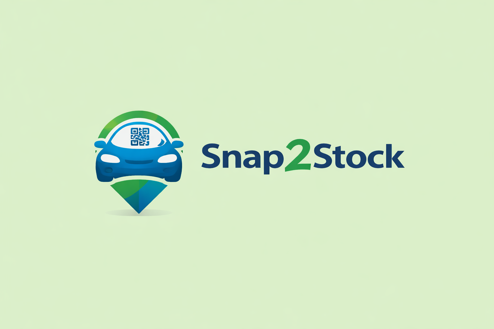

# Snap2Stock



> **探す前に分かる、AI ヤード在庫管理システム**

中小規模の中古車輸出ヤード向けの在庫管理システムです。Excel 運用を壊さずに、車が「どこにあるか探す時間」をなくすことに特化しています。Gemini API による写真からの車両情報の自動入力と、QR コードを使ったヤード内の位置管理が特徴です。

> 2025/12/20 – 2025/12/21 に開催された技育 CAMP ハッカソンでの成果物です。

🌐 **[デモを試す](https://snap2stock-9w7mgrnak-rikigoto0310-2143.vercel.app/)**

📄 **[発表スライド（PDF）](docs/Snap2Stock-presentation.pdf)** — プロダクトの背景・機能・競合比較をまとめた発表資料です。

## 背景・課題

中小企業の中古車輸出の現場には、以下の課題があります。

- **ローテク** — 出品前の車両にはナンバープレートがなく、どこにどの車があるか手探りで管理している
- **コスト意識** — 高額な在庫管理システムは導入しづらく、初期投資を抑えるため Excel ベースの運用が多い

Snap2Stock は、大企業向けの高精度管理と、中小ヤードの属人的な管理の "間" に立つ **現場ファーストな車両管理システム** を目指しています。既存の Excel 運用を活かしつつ、探す時間をなくすことにフォーカスしました。

## 主な機能

- **マスターデータの Excel インポート** — 既存の Excel をインポートするだけで導入できる
- **ヤードの地図化** — ヤードを地図化し、車がどのゾーンにあるかを一目で確認できる
- **QR コードの生成・印刷** — 車体情報を含む QR コードを生成し、プリントアウトできる
- **QR スキャンによる位置更新** — QR コードから車両情報を確認し、ヤード内のスロット位置を変更できる
- **AI による入力補助** — AI（Gemini）が写真から車種などを推測し、車両データの入力を簡略化する

### 画面構成

- **Dashboard** — 在庫サマリ、本日出庫予定の確認、Excel インポート
- **Stock List / Yard Map** — 在庫一覧とヤードマップ表示
- **Vehicle Registration** — ヤードマップから入庫位置を選んで車両登録（写真から自動入力）
- **QR Scanner** — カメラ / 画像から車両を特定し、ゾーンを更新（Gemini API）

## 競合との比較

| 特徴 | 📷 Snap2Stock | 中小・個人ヤード | 大企業ヤード |
|---|---|---|---|
| 管理方法 | Excel × AI × QR | Excel / 紙 / 記憶 | オーダーメイドシステム |
| 位置管理方式 | Zone（簡易位置管理） | 人の記憶・目視 | GPS |
| リアルタイム性 | なし | なし | あり |
| 初期導入コスト | 低 | 低 | 非常に高 |
| 探索時間 | 短い | 長い | 短い |
| 想定規模 | 中小規模 | 小規模 | 大規模 |

## 技術スタック

- [Vite](https://vitejs.dev/) + [React 19](https://react.dev/)（TypeScript）
- [Tailwind CSS](https://tailwindcss.com/)（CDN 経由）
- [Google Gemini API](https://ai.google.dev/)（`@google/genai`）— 画像からの車両情報抽出・QR スキャン
- [lucide-react](https://lucide.dev/)（アイコン） / [xlsx](https://sheetjs.com/)（Excel 入出力）

車両データはブラウザの `localStorage` に保存されます。画像解析は `api/analyze.ts` のVercel Function経由でGemini APIを呼び出します。

## ディレクトリ構成

```text
Snap2Stock/
├── api/                 # サーバー側：Vercel Functions
│   └── analyze.ts
├── src/                 # ブラウザ側のReactアプリ
│   ├── App.tsx
│   ├── main.tsx         # アプリのエントリーポイント
│   ├── pages/           # Dashboard・在庫一覧・入庫・スキャナーなどの画面
│   ├── components/      # VehicleForm・YardMapなど画面内の部品
│   ├── services/        # 画像解析APIの呼び出し
│   ├── assets/          # ロゴなど、ビルドに含める画像
│   ├── types.ts
│   ├── constants.ts
│   └── vite-env.d.ts
├── tests/               # APIのテスト
├── docs/                # 発表資料・draw.io図
├── index.html
├── vite.config.ts
├── vercel.json
├── tsconfig.json
├── package.json
├── package-lock.json
├── .env.example         # 値を含まない環境変数のひな形
└── .env.local           # ローカルの秘密情報（Git管理対象外）
```

`@/` のエイリアスは `src/` を指します。GeminiのSDKと秘密のAPIキーはサーバー側でのみ使用し、フロントエンドにはAPI呼び出し処理を置きます。

## セットアップ

**前提:** Node.js 22.13以降（テストでTypeScriptの型除去機能を使用）

1. 依存関係をインストール:
   ```bash
   npm install
   ```
2. `.env.local` に Gemini API キーを設定:
   ```
   GEMINI_API_KEY=あなたのAPIキー
   ```
   > `.env.local` は `.gitignore` 済みです。API キーを git にコミットしないでください。
3. 開発サーバーを起動:
   ```bash
   npm run dev
   ```

`npm run dev` は画面だけを起動します。Vercel Functionsを含めて画像解析を試す場合は `npm run dev:vercel` を使用します（Vercel CLIの取得とアカウント接続が必要です）。キーを設定しなくても画面は利用できますが、画像解析は未設定エラーになります。本番のキーはVercelの環境変数に登録します。

## スクリプト

| コマンド | 内容 |
|---|---|
| `npm run dev` | 開発サーバーを起動（ポート 3000） |
| `npm run build` | 本番ビルドを `dist/` に出力 |
| `npm run preview` | ビルド成果物をプレビュー |
| `npm run dev:vercel` | 画面とVercel Functionsをローカルで起動 |
| `npm run typecheck` | TypeScriptの型チェック |
| `npm test` | ゾーン・在庫・APIのテスト（Geminiへの実通信なし） |
